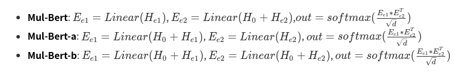

# Mul-BERT

Pytorch implementation of **Mul-BERT**:  [Relation Classification Based on Entity Product with Semantic Information](http://) **Under Review**

# Model Architecture
<!--


height="100" width="100"


This paper proposes a total of three model structures (**mul-bert**, **mul-bert-a**, **mul-bert-b**), the following is the corresponding model structure diagram .
## 1. mul-bert model Architecture
<center>

  

</center>

## 2. mul-bert-a model Architecture
<center>

  

</center>

## 3. mul-bert-b model Architecture
<center>

  

</center>

# Method
**1. Get three vectors from BERT**
  * The word embedding vector of [CLS]  token;  ->  **$H_0$**  as the Semantic information
  * The average value of two entity;  ->  **$H_{e1}=\frac{1}{j-i+1}\sum_{t=i}^{j}H_t$**, **$H_{e2}=\frac{1}{m-k+1}\sum_{t=k}^{m}H_t$**

**2. Formulas for the next steps of the three models**
<!--
* **Mul-Bert**:   $E_{e1}=Linear(H_{e1})$,  $ E_{e2} = Linear(H_0 + H_{e2}) $,$out = softmax(\frac{E_{e1}*E_{e2}^T}{\sqrt{d}})$
* **Mul-Bert-a**: $ E_{e1}=Linear(H_0 + H_{e1}) $, $E_{e2}=Linear(H_{e2})$,   $out = softmax(\frac{E_{e1}*E_{e2}^T}{\sqrt{d}})$
* **Mul-Bert-b**:   $ E_{e1}=Linear(H_0 + H_{e1}) $, $E_{e2}=Linear(H_0 + H_{e2})$,   $out = softmax(\frac{E_{e1}*E_{e2}^T}{\sqrt{d}})$
-->


> **Remarks:**
>> * Linear (Dense)  is fully connected layer;
>> * The **Reshape** operation is omitted in the formula for the convenience of explanation;  **Reshape operation is a key operation, you can read the code if you don‘t understand**
>> * \*  Represents matrix multiplication；
>> *  Excluding BERT, the model  only uses two fully-connected layers, which is a very very very simple and efficient model;

# Dependencies
* perl (For evaluating official f1 score)
* python>=3.6
* torch   >= 1.6.0+cu92
* transformers  >=  2.8.0
* pandas    >=   0.25.0

# How to RUN
**1. Mul-Bert**:
```bash 
cd mul_bert
python mul_bert_Test.py
```


**2. Mul-Bert-a**:
```bash
cd mul_bert_a
python mul_bert_a_Test
```

**3. Mul-Bert-a**:
```bash
cd mul_bert_b
python mul_bert_b_Test
```
**Remarks:**
> Modify BERT large or base , and modify the model loading path in **config.py**;

# References
[Semeval 2010 Task 8 Dataset](https://drive.google.com/file/d/0B_jQiLugGTAkMDQ5ZjZiMTUtMzQ1Yy00YWNmLWJlZDYtOWY1ZDMwY2U4YjFk/view?sort=name&layout=list&num=50)  
[Huggingface Transformers](https://github.com/huggingface/transformers)  
[R-BERT](https://github.com/monologg/R-BERT)


 