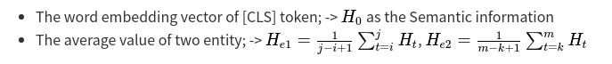

# Mul-BERT

Pytorch implementation of **Mul-BERT**:  [Relation Classification Based on Entity Product with Semantic Information](http://) **Under Review**

This paper proposes a total of three model structures (**mul-bert**, **mul-bert-a**, **mul-bert-b**),   The official score on the SemEval 2010 Task 8 dataset is up to **90.72** (Macro-F1).

**Official Evaluation Results on SemEval 2010 Task 8:**
 | Models | Base (Macro-F1 / %)  | Large(Macro-F1 / %)|
 |:----:|:-----:|:------:|
 |Mul-Bert-a| **88.84** | **89.55** |
 |Mul-Bert-b| **89.17** | **90.72 (91.05\*)**|
 |Mul-Bert| **89.43** | **90.28** |

# Model Architecture
<!--


height="100" width="100"

## 1. mul-bert model Architecture
<center>

  

</center>

## 2. mul-bert-a model Architecture
<center>

  

</center>

## 3. mul-bert-b model Architecture
<center>

  

</center>

# Method
**1. Get three vectors from BERT**
<!--
  * The word embedding vector of [CLS]  token;  ->  **$H_0$**  as the Semantic information
  * The average value of two entity;  ->  **$H_{e1}=\frac{1}{j-i+1}\sum_{t=i}^{j}H_t$**, **$H_{e2}=\frac{1}{m-k+1}\sum_{t=k}^{m}H_t$**
-->


**2. Formulas for the next steps of the three models**
<!--
* **Mul-Bert**:   $E_{e1}=Linear(H_{e1})$,  $ E_{e2} = Linear(H_0 + H_{e2}) $,$out = softmax(\frac{E_{e1}*E_{e2}^T}{\sqrt{d}})$
* **Mul-Bert-a**: $ E_{e1}=Linear(H_0 + H_{e1}) $, $E_{e2}=Linear(H_{e2})$,   $out = softmax(\frac{E_{e1}*E_{e2}^T}{\sqrt{d}})$
* **Mul-Bert-b**:   $ E_{e1}=Linear(H_0 + H_{e1}) $, $E_{e2}=Linear(H_0 + H_{e2})$,   $out = softmax(\frac{E_{e1}*E_{e2}^T}{\sqrt{d}})$
-->


> **Remarks:**
>> * Linear (Dense)  is fully connected layer;
>> * The **Reshape** operation is omitted in the formula for the convenience of explanation;  **Reshape operation is a key operation, you can read the code if you don‘t understand**
>> * \*  Represents matrix multiplication；
>> *  Excluding BERT, the model  only uses two fully-connected layers, which is a very very very simple and efficient model;

# Dependencies
* perl (For evaluating official f1 score)
* python>=3.6
* torch   >= 1.6.0+cu92
* transformers  >=  2.8.0
* pandas    >=   0.25.0

# How to RUN
**The output is in the SemEval-2010 Task 8 Test Dataset Official Evaluation Results**

**first,  Need to download the corresponding model and put it in the Model folder under each model**

**1. Mul-Bert**:   model checkpoint download URL:  [百度网盘 密码: 38fo][mul-bert百度];      [google Drive][mul-bert-google]
```bash 
cd mul_bert
python mul_bert_Test.py
```
Bert Base Results: 
```
Micro-averaged result (excluding Other):
P = 2055/2311 =  88.92%     R = 2055/2263 =  90.81%     F1 =  89.86%

MACRO-averaged result (excluding Other):
P =  88.64%     R =  90.27%     F1 =  89.43%

<<< The official score is (9+1)-way evaluation with directionality taken into account: macro-averaged F1 = 89.43% >>>
```

Bert Large Results:
```
Micro-averaged result (excluding Other):
P = 2072/2308 =  89.77%     R = 2072/2263 =  91.56%     F1 =  90.66%

MACRO-averaged result (excluding Other):
P =  89.50%     R =  91.09%     F1 =  90.28%

<<< The official score is (9+1)-way evaluation with directionality taken into account: macro-averaged F1 = 90.28% >>>
```
[mul-bert百度]:https://pan.baidu.com/s/1-cYUkoZzNq_g1IBNx9T89g  
[mul-bert-google]:https://drive.google.com/drive/folders/1Q_zfMmZfO_8RtHaQ9QO6v3D6Dwm1Y7fe

**2. Mul-Bert-a**: download URL: [百度网盘 5w71][mul-bert-a百度],  [google Drive][mul-bert-a-google]
```bash
cd mul_bert_a
python mul_bert_a_Test
```
BERT Base Results: 
```
Micro-averaged result (excluding Other):
P = 2039/2305 =  88.46%     R = 2039/2263 =  90.10%     F1 =  89.27%

MACRO-averaged result (excluding Other):
P =  88.04%     R =  89.66%     F1 =  88.84%

<<< The official score is (9+1)-way evaluation with directionality taken into account: macro-averaged F1 = 88.84% >>>
```
BERT Large Results:
```
Micro-averaged result (excluding Other):
P = 2068/2331 =  88.72%     R = 2068/2263 =  91.38%     F1 =  90.03%

MACRO-averaged result (excluding Other):
P =  88.31%     R =  90.87%     F1 =  89.55%

<<< The official score is (9+1)-way evaluation with directionality taken into account: macro-averaged F1 = 89.55% >>>
```
[mul-bert-a百度]:https://pan.baidu.com/s/1N3nNVLG8wr9NzO5IjWGleA  
[mul-bert-a-google]:https://drive.google.com/drive/folders/1OUBiW8hq4Pi9PUc618gxPJ3GU4jk8rV7?usp=sharing
**3. Mul-Bert-b**:  [百度网盘  8hwb][mul-bert-b百度], [google Drive][mul-bert-b-google]
```bash
cd mul_bert_b
python mul_bert_b_Test
```
BERT Large Results:
```
Micro-averaged result (excluding Other):
P = 2081/2308 =  90.16%     R = 2081/2263 =  91.96%     F1 =  91.05%

MACRO-averaged result (excluding Other):
P =  89.98%     R =  91.52%     F1 =  90.72%

<<< The official score is (9+1)-way evaluation with directionality taken into account: macro-averaged F1 = 90.72% >>>
```
[mul-bert-b百度]:https://pan.baidu.com/s/16vNZAnh4nZMoO7O-KQILMQ 
[mul-bert-b-google]:https://drive.google.com/drive/folders/1Fwz6sbd05vhtnvAaa9b68pA-TJmwdUb9?usp=sharing
**Remarks:**
> Modify BERT large or base , and modify the model loading path in **config.py**;

# References
[Semeval 2010 Task 8 Dataset](https://drive.google.com/file/d/0B_jQiLugGTAkMDQ5ZjZiMTUtMzQ1Yy00YWNmLWJlZDYtOWY1ZDMwY2U4YjFk/view?sort=name&layout=list&num=50)  
[Huggingface Transformers](https://github.com/huggingface/transformers)  
[R-BERT](https://github.com/monologg/R-BERT)


 