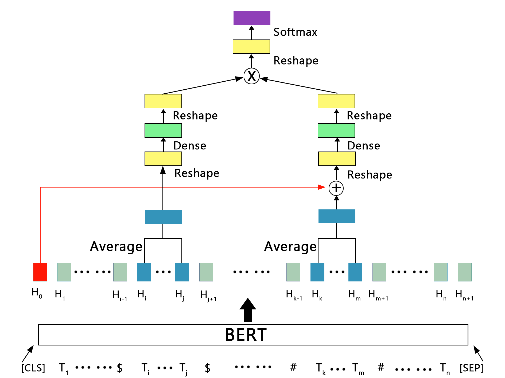
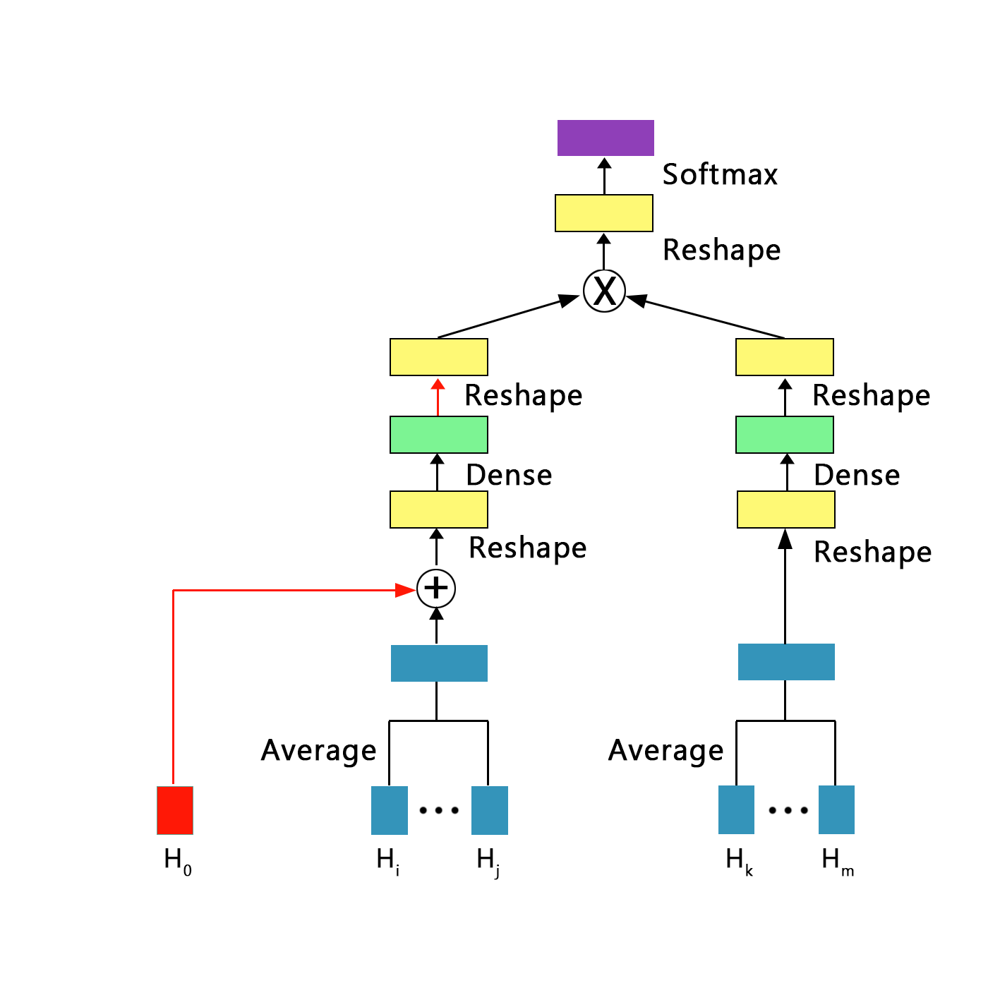
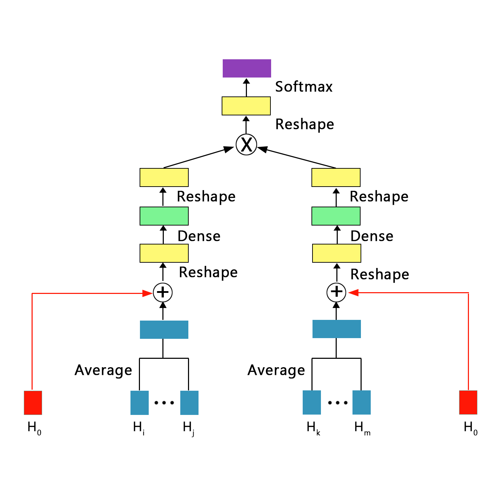

# Mul-BERT

Pytorch implementation of **Mul-BERT**:  [Relation Classification Based on Entity Product with Semantic Information](http://) **Under Review**

# Model Architecture
<!--

height="100" width="100"

  

**mul-bert model architecture**

# Method

# Dependencies

# How to RUN

# Official Evaluation

# References
[Semeval 2010 Task 8 Dataset](https://drive.google.com/file/d/0B_jQiLugGTAkMDQ5ZjZiMTUtMzQ1Yy00YWNmLWJlZDYtOWY1ZDMwY2U4YjFk/view?sort=name&layout=list&num=50)  
[Huggingface Transformers](https://github.com/huggingface/transformers)  
[R-BERT](https://github.com/monologg/R-BERT)

 